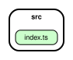

<div align="center">


# TS Bastion

_A TypeScript project template centered around code quality and CI/CD._

[](https://github.com/SirEriTheRed/ts-bastion/actions)
[](https://github.com/SirEriTheRed/ts-bastion)
[](https://nodejs.org)
[](./LICENSE)
[](https://scorecard.dev/viewer/?uri=github.com/SirEriTheRed/ts-bastion)
[](http://commitizen.github.io/cz-cli/)

[Install](#installation) • [Documentation](#documentation) • [FAQ](#faq) • [Resources](#resources) • [Contributing](#contributing) • [Contact](#contact)

</div>

---

## Table of Contents

- [TS Bastion](#ts-bastion)
  - [Table of Contents](#table-of-contents)
  - [Why TS Bastion?](#why-ts-bastion)
    - [The problem it solves](#the-problem-it-solves)
    - [Best for](#best-for)
    - [How it compares](#how-it-compares)
  - [Template Contents](#template-contents)
  - [Prerequisites](#prerequisites)
  - [Getting Started](#getting-started)
    - [Installation](#installation)
    - [Quick Start](#quick-start)
    - [Basic Usage](#basic-usage)
  - [Usage](#usage)
  - [External Tools (Manual Installation Required)](#external-tools-manual-installation-required)
  - [Tooling](#tooling)
  - [Scripts](#scripts)
  - [Conventions](#conventions)
  - [Dependency Graph](#dependency-graph)
  - [API Documentation](#api-documentation)
  - [Documentation](#documentation)
  - [Publishing & Provenance](#publishing--provenance)
  - [FAQ](#faq)
  - [Resources](#resources)
  - [Contact](#contact)
  - [Contributing](#contributing)
    - [Contributors](#contributors)
  - [Thanks & Acknowledgments](#thanks--acknowledgments)
  - [License](#license)
  - [Technologies Used](#technologies-used)
  - [Template Source](#template-source)

---

## Why TS Bastion?

Most TypeScript starters give you `tsc` + a loose ESLint config and stop. You inherit configuration debt on day one — inconsistent style, no supply-chain hardening, no provenance, and no visibility into dependency health.

TS Bastion is the opposite: **zero runtime dependencies, maximal guardrails**. Clone and ship without spending a week wiring quality and security.

### The problem it solves

- **Config fatigue** — strict `tsconfig` (`strict`, `verbatimModuleSyntax`, `exactOptionalPropertyTypes`, `noUncheckedIndexedAccess`, `skipLibCheck:false`) done right from the start.
- **Quality drift** — ESLint flat config with `typescript-eslint` strict + stylistic type-checked, plus `unicorn`, `sonarjs`, `security`, `import-x`, `promise`, `regexp`, `tsdoc`, and `prettier` — enforced on pre-commit and CI.
- **Supply-chain blind spots** — `lockfile-lint`, `osv-scanner`, `npm audit signatures`, dual SBOM (SPDX + CycloneDX), and Sigstore attestations (SLSA L2 default, SLSA L3 with npm Trusted Publisher) out of the box.
- **CI as an afterthought** — `quality.yml`, `actionlint`, `zizmor`, and `CodeQL` (`security-extended`) are already wired and blocking.

### Best for

- Teams that want a **batteries-included, audit-ready** baseline without framework lock-in (API, CLI, library, or worker — single-package ESM).
- Maintainers who need **reproducible releases** via `semantic-release` + conventional commits + provenance, with `dist/**` attested on every tag.
- Projects where **dead code and dependency drift matter** — `knip` + `dependency-cruiser` (`no-circular`, `no-orphans`, `no-non-package-json`) + committed `dependency-graph.svg`.

### How it compares

| Capability            | TS Bastion                                                                                                                               | Typical TS starter / `create-*` / `tsdx`                                               |
| --------------------- | ---------------------------------------------------------------------------------------------------------------------------------------- | -------------------------------------------------------------------------------------- |
| TypeScript strictness | `strict` + `verbatimModuleSyntax` + `exactOptionalPropertyTypes` + `noUncheckedIndexedAccess` + `skipLibCheck:false`                     | `strict:true` only; `verbatimModuleSyntax`/`exactOptionalPropertyTypes` rarely enabled |
| Lint / style          | ESLint strict type-checked + unicorn/sonarjs/security/import-x + Prettier + `editorconfig-checker` + `cspell` + `ls-lint` + `secretlint` | ESLint `recommended` only; no filename, spell, or secret linting                       |
| Git hygiene           | Husky + lint-staged (`eslint --fix`, `prettier --write`, `type-check` on `.ts`) + commitlint + commitizen                                | Often no hooks or only `prettier`                                                      |
| Tests                 | Vitest `globals:true` + `@vitest/coverage-v8` with **80%** thresholds (lines/functions/branches/statements)                              | Jest/Vitest without thresholds or coverage gate                                        |
| Dead code / deps      | `knip` + `dependency-cruiser` (`err-long`, `err-html`, `dot` graph)                                                                      | Not included                                                                           |
| Workflow security     | `actionlint` + `zizmor` (SARIF → Code scanning) + `CodeQL` `security-extended`                                                           | Not included                                                                           |
| Supply chain          | `lockfile-lint` + `osv-scanner` (SARIF) + `npm audit signatures` + SBOM SPDX/CycloneDX + Sigstore attestations (SLSA L2/L3)              | At most `npm audit`                                                                    |
| Releases              | `semantic-release` (`changelog`/`git`/`npm`) + `provenance:true` + Trusted Publisher (no `NPM_TOKEN`)                                    | Manual `npm publish` or basic `semantic-release`                                       |
| Docs                  | TypeDoc markdown (committed `docs/`) + HTML (`reports/docs/`) from TSDoc                                                                 | README only                                                                            |
| Runtime deps          | **0** — add only what you need                                                                                                           | Often ships with scaffolding deps                                                      |

> **Trade-off:** TS Bastion is intentionally strict. If you want a permissive, unopinionated starter, this will feel opinionated — by design. Strictness is the feature.

[↑ Back to top](#table-of-contents)

---

## Template Contents

Minimal yet strict template, ready to clone to start a TypeScript project (API, CLI, library or worker) without configuration debt.

## Prerequisites

- Node.js `>=20` (`lts/jod` recommended, see `.nvmrc`)
- npm `>=10`

## Getting Started

### Installation

```bash
# 1. Clone
git clone https://github.com/SirEriTheRed/ts-bastion.git my-project
cd my-project

# 2. Rename for your project
# - package.json: "name" field (@scope/name)
# - README.md: title + badges [owner]/[repo]
# - LICENSE: holder if different

# 3. Install dependencies
npm install

# 4. Reset git history
rm -rf .git && git init && git add . && git commit -m "feat: initial commit"

# 5. First push
git remote add origin <your-repo-url>
git push -u origin main
```

### Quick Start

```bash
npm run build
npm test
npm run dev    # watch mode
```

### Basic Usage

```ts
import { logHello } from './src/index.js';

console.log(logHello()); // "hello world!"
```

> Replace the `logHello()` example with your own public API as you build out the template.

## Usage

Use the cloned template as a starting point for any TypeScript project (API, CLI, library, or
worker). Update imports to use `.js` extensions (`verbatimModuleSyntax`) and run the scripts
listed below.

## External Tools (Manual Installation Required)

> These tools are **not** in `package.json` and must be installed separately. CI installs them automatically where needed, but locally you need them for certain commands.

| Tool                     | Role in Project                                                                                                                                       | Install                                                                                                                         | When Required?                                                                                                                                              |
| ------------------------ | ----------------------------------------------------------------------------------------------------------------------------------------------------- | ------------------------------------------------------------------------------------------------------------------------------- | ----------------------------------------------------------------------------------------------------------------------------------------------------------- |
| **Go** `>=1.21`          | Required to install `osv-scanner` via `go install` for local `npm run osv*`; CI uses `google/osv-scanner-action@v2` (no Go needed)                    | https://go.dev/dl/ or `brew install go` / `apt install golang`                                                                  | `npm run osv`, `npm run osv:html` (local only; CI: no Go, SARIF via action → Security > Code scanning)                                                      |
| **osv-scanner**          | Vulnerability scanning — Go binary `github.com/google/osv-scanner/v2` (`npm run osv` local, SARIF in CI)                                              | `go install github.com/google/osv-scanner/v2/cmd/osv-scanner@latest` then `export PATH=$PATH:$(go env GOPATH)/bin` (local only) | any `npm run osv*` locally; in CI via `google/osv-scanner-action@v2` → `reports/osv.sarif` → Security > Code scanning (`osv:html` local-only)               |
| **zizmor** `>=1.30`      | GitHub Actions security audit — CI via `.github/workflows/zizmor.yml` (`zizmorcore/zizmor-action@v0.6.4` → SARIF `zizmor` → Security > Code scanning) | `cargo install zizmor` · `pipx install zizmor` · `brew install zizmor` · binary at `github.com/woodruffw/zizmor/releases`       | `npm run zizmor` / `npm run zizmor:sarif` locally; in CI auto on push/PR/schedule → Security > Code scanning (branch protection ruleset blocks PR on alert) |
| **actionlint** `v1.7.12` | Linter workflows GitHub Actions — `actionlint -color` + shellcheck                                                                                    | `go install github.com/rhysd/actionlint/cmd/actionlint@latest` · `brew install actionlint` · script download                    | `npm run actionlint` local (recommended); CI via `.github/workflows/actionlint.yml` (blocking)                                                              |
| **Graphviz** (`dot`)     | Generates `dependency-graph.svg` (`npm run depcruise:graph`)                                                                                          | `brew install graphviz` / `apt install graphviz` / https://graphviz.org/download/                                               | `npm run depcruise:graph` only                                                                                                                              |
| **Git** `>=2.40`         | Husky hooks, `git-auto-commit-action` (`docs` job), `semantic-release`                                                                                | https://git-scm.com/downloads                                                                                                   | always                                                                                                                                                      |

> **Tip:** verify locally with `go version && osv-scanner --version && zizmor --version && dot -V`

## Tooling

| Category      | Tool / Config                                                                                                                                                                                              | Version / Detail     |
| ------------- | ---------------------------------------------------------------------------------------------------------------------------------------------------------------------------------------------------------- | -------------------- |
| Language      | TypeScript strict (`strict`, `verbatimModuleSyntax`, `exactOptionalPropertyTypes`, `noUncheckedIndexedAccess`)                                                                                             | `^5.9`               |
| Lint          | ESLint flat config + `typescript-eslint` (strict + stylistic type-checked), `eslint-plugin-unicorn`, `eslint-plugin-sonarjs`, `eslint-plugin-security`, `eslint-plugin-import-x`, `eslint-config-prettier` | `^10`                |
| Format        | Prettier (`semi`, `singleQuote`, `tabWidth:2`, `printWidth:100`)                                                                                                                                           | `^3.8`               |
| Tests         | Vitest (`globals:true`) + `@vitest/coverage-v8`, 80% thresholds for lines/functions/branches/statements                                                                                                    | `^4.1`               |
| Dead code     | Knip                                                                                                                                                                                                       | `^6.16`              |
| Deps          | dependency-cruiser (`err-long`)                                                                                                                                                                            | `^18.2`              |
| Git hooks     | Husky + lint-staged (`eslint --fix` + `prettier --write` on `*.{js,ts}` + `type-check` if `.ts` staged) + commitlint (`@commitlint/config-conventional`)                                                   | `^9` / `^17` / `^21` |
| Release       | semantic-release (`@semantic-release/changelog`, `@semantic-release/git`, `@semantic-release/npm`)                                                                                                         | `^25`                |
| Documentation | TypeDoc + `typedoc-plugin-markdown`                                                                                                                                                                        | `^0.28`              |
| Spell check   | CSpell                                                                                                                                                                                                     | `^10`                |
| Lockfile      | lockfile-lint (`--allowed-hosts npm --validate-https --validate-integrity --empty-hostname false` on `package-lock.json` lockfileVersion 3)                                                                | `^5.0`               |
| Filename      | ls-lint (`.ls-lint.yml`, `kebab-case` + `SCREAMING_SNAKE_CASE` for `*.md`)                                                                                                                                 | `2.3.1`              |
| Workflow lint | actionlint (`actionlint -color` + shellcheck, `v1.7.12`)                                                                                                                                                   | `1.7.12`             |

## Scripts

| Command                       | Action                                                                                                                                                                                       |
| ----------------------------- | -------------------------------------------------------------------------------------------------------------------------------------------------------------------------------------------- |
| `npm run build`               | `tsc` — compiles `src/` → `dist/`                                                                                                                                                            |
| `npm run clean`               | `rm -rf dist`                                                                                                                                                                                |
| `npm run cleanup`             | `rm -rf dist reports .nyc_output tmp temp .cache *.tsbuildinfo` — cleans build + reports                                                                                                     |
| `npm run dev`                 | `tsc --watch`                                                                                                                                                                                |
| `npm run type-check`          | `tsc --noEmit` (source only)                                                                                                                                                                 |
| `npm run type-check:tests`    | `tsc --noEmit -p tsconfig.test.json` (src + tests)                                                                                                                                           |
| `npm run lint`                | `eslint .`                                                                                                                                                                                   |
| `npm run lint:fix`            | `eslint . --fix`                                                                                                                                                                             |
| `npm run format`              | `prettier --write .`                                                                                                                                                                         |
| `npm run format:check`        | `prettier --check .`                                                                                                                                                                         |
| `npm run lint:spell`          | `cspell lint "**/*.{ts,md,json}"`                                                                                                                                                            |
| `npm run lockfile-lint`       | `lockfile-lint --type npm --path package-lock.json --allowed-hosts npm --validate-https --validate-integrity --empty-hostname false`                                                         |
| `npm run ls-lint`             | `ls-lint` — filename/dir linter (`kebab-case`, `.ls-lint.yml`)                                                                                                                               |
| `npm test`                    | `vitest run` — fast without coverage (80% thresholds via `npm run test:coverage`)                                                                                                            |
| `npm run test:coverage`       | `vitest run --coverage` — with 80% thresholds → `reports/coverage/`                                                                                                                          |
| `npm run test:coverage:watch` | `vitest --coverage` (watch with coverage)                                                                                                                                                    |
| `npm run test:watch`          | `vitest` (watch)                                                                                                                                                                             |
| `npm run test:ui`             | `vitest --ui`                                                                                                                                                                                |
| `npm run knip`                | `knip` — dead-code analysis                                                                                                                                                                  |
| `npm run analyze`             | alias `knip`                                                                                                                                                                                 |
| `npm run osv`                 | `osv-scanner scan source -r .` — blocking (exits 1 on vuln) — local (requires Go/binary); CI uses `google/osv-scanner-action@v2` → SARIF (blocking, Security > Code scanning)                |
| `npm run osv:html`            | `osv-scanner --format html --output-file reports/osv-report.html` — blocking + HTML — local-only (requires Go/binary, not generated in CI)                                                   |
| `npm run osv:html:force`      | same as `osv:html` but non-blocking (`\|\| true`) — local-only                                                                                                                               |
| `npm run sbom`                | `npm sbom --sbom-format spdx --package-lock-only` → `reports/sbom/sbom.spdx.json` (GitHub Dependency Graph)                                                                                  |
| `npm run sbom:cyclonedx`      | `npm sbom --sbom-format cyclonedx --package-lock-only` → `reports/sbom/sbom.cyclonedx.json`                                                                                                  |
| `npm run sbom:all`            | `npm run sbom && npm run sbom:cyclonedx` — generates both                                                                                                                                    |
| `npm run sbom:validate`       | `npx @cyclonedx/cyclonedx-cli validate` → validates `reports/sbom/sbom.cyclonedx.json` (non-blocking)                                                                                        |
| `npm run zizmor`              | `zizmor .` — GitHub Actions audit (requires `zizmor` binary); CI via `zizmorcore/zizmor-action@v0.6.4` → SARIF `zizmor` → Security > Code scanning                                           |
| `npm run zizmor:sarif`        | `zizmor --format sarif . > reports/zizmor.sarif` — local SARIF preview (same `--format=sarif` as CI, `exit 0` always; block via Code Scanning ruleset)                                       |
| `npm run depcruise`           | `depcruise src --output-type err-long`                                                                                                                                                       |
| `npm run actionlint`          | `actionlint -color` — linter workflows GitHub Actions + shellcheck (`-pyflakes=""`) — local recommended (requires `actionlint` binary); CI via `.github/workflows/actionlint.yml` (blocking) |
| `npm run actionlint:docker`   | `docker run --rm -v $(pwd):/repo --workdir /repo rhysd/actionlint:1.7.12 -color` — sans Go via Docker                                                                                        |
| `npm run depcruise:html`      | `depcruise src --output-type err-html` → `reports/depcruiser/index.html`                                                                                                                     |
| `npm run depcruise:graph`     | `depcruise src --output-type dot \| dot -T svg > dependency-graph.svg` (requires Graphviz)                                                                                                   |
| `npm run docs`                | `typedoc` — generates `docs/*.md` (committed markdown) from TSDoc                                                                                                                            |
| `npm run docs:html`           | `typedoc --options typedoc.html.json` → `reports/docs/index.html` (browsable HTML, gitignored)                                                                                               |
| `npm run docs:watch`          | `typedoc --watch`                                                                                                                                                                            |
| `npm run release`             | `semantic-release`                                                                                                                                                                           |
| `npm run release:dry`         | `semantic-release --dry-run`                                                                                                                                                                 |

## Conventions

- **Filenames**: `kebab-case` via `ls-lint` (`.ls-lint.yml`) + `unicorn/filename-case`
- **No default exports**: `import/no-default-export: error`
- **Type imports**: `import type` required for types (`consistent-type-imports`), order `builtin → external → internal → parent → sibling → index` (grouped, alphabetized)
- **Modules**: `verbatimModuleSyntax: true` — `.js` extensions in relative imports
- **tsconfig**: `skipLibCheck:false`, `exactOptionalPropertyTypes:true`, `noUncheckedIndexedAccess:true`; tests excluded from main `tsconfig.json`, checked via `tsconfig.test.json` (`vitest/globals`, `noUnusedLocals:false`)
- **Pre-commit**: `lint-staged` + `husky` + `commitlint` (conventional commits)
- **CI**: see `AGENTS.md` and `.github/workflows/`

## Dependency Graph

Rules defined in [`.dependency-cruiser.cjs`](./.dependency-cruiser.cjs) (`no-circular`, `no-orphans`, `no-non-package-json`, `not-to-dev-dep`, …) — verify with:

```bash
npm run depcruise
```

Graph generated with `dependency-cruiser` + Graphviz (`dot`):

```bash
npm run depcruise:graph
# or: npx depcruise src --include-only '^src' --output-type dot | dot -T svg > dependency-graph.svg
```



> The SVG is committed and automatically regenerated on pre-commit if `src/` or `.dependency-cruiser.cjs` is staged (requires Graphviz `dot`); `npm run depcruise:graph` remains available manually.

## API Documentation

TSDoc comments from `src/` are published via TypeDoc:

```bash
npm run docs        # committed markdown → docs/*.md
npm run docs:html   # browsable site → reports/docs/index.html (gitignored)
```

`dependency-graph.svg` stays at the root (referenced above). All HTML/coverage reports are centralized in `reports/` (gitignored, cleaned by `npm run cleanup`):

```text
reports/
├── coverage/index.html      ← vitest html
├── sbom/sbom.spdx.json      ← npm sbom --sbom-format spdx (GitHub Dependency Graph)
├── sbom/sbom.cyclonedx.json ← npm sbom --sbom-format cyclonedx
├── osv.sarif                ← osv-scanner --format sarif (CI → Security > Code scanning; local: npm run osv)
├── osv-report.html          ← osv-scanner --format html (local-only: npm run osv:html, not generated in CI)
├── zizmor.sarif             ← zizmor --format sarif (CI via zizmor-action category zizmor → Security > Code scanning; local: npm run zizmor:sarif)
├── docs/index.html          ← typedoc html
└── depcruiser/index.html    ← dependency-cruiser err-html
```

## Documentation

Full documentation lives in [`docs/`](./docs) — generated from TSDoc via TypeDoc. Browse
quickstart, API reference, and guides:

- API docs: [`docs/README.md`](./docs/README.md) (markdown, committed)
- HTML site: `reports/docs/index.html` (generated via `npm run docs:html`)
- Dependency graph: see [Dependency Graph](#dependency-graph) above

Run `npm run docs` to regenerate.

[↑ Back to top](#table-of-contents)

---

<!-- Publishing modes:
    Default (private:true): GitHub attestations only (SLSA L2) — dist/** + SBOM via Sigstore, no npm publish.
    Full-security: set package.json private:false + .releaserc.json npmPublish:true + configure Trusted Publisher on npmjs.com → npm provenance (SLSA L3) via OIDC, no NPM_TOKEN needed. -->

## Publishing & Provenance

| Mode           | `package.json:private` | `.releaserc.json:npmPublish`              | npm Trusted Publisher                                                                            | Result                                                                                                            |
| -------------- | ---------------------- | ----------------------------------------- | ------------------------------------------------------------------------------------------------ | ----------------------------------------------------------------------------------------------------------------- |
| Default (safe) | `true`                 | `false`                                   | —                                                                                                | GitHub attestations only (SLSA L2): `dist/**` + SBOM attested via Sigstore on every release                       |
| Full-security  | `false`                | `true` (or remove option, default `true`) | Add on npmjs.com → package Settings → Trusted Publishers → `owner/repo` + workflow `release.yml` | npm provenance (SLSA L3) via OIDC — `@semantic-release/npm` auto-publishes with provenance; no `NPM_TOKEN` needed |

> `publishConfig.provenance` + `.npmrc:provenance=true` are redundant but explicit. `release.yml` already has `id-token:write` + `attestations:write`; `npm pack` is validated without publishing when `private:true`. Verify attestations with `gh attestation verify --owner <owner> dist/index.js`.

[↑ Back to top](#table-of-contents)

---

## FAQ

<details>
<summary><strong>Is the template publishable by default? How do I enable npm provenance?</strong></summary>

No. `package.json#private` is `true` and `.releaserc.json#npmPublish` is `false`, so `release.yml` only creates GitHub attestations (SLSA L2) for `dist/**` + SBOM via Sigstore. To publish with npm provenance (SLSA L3), set `private:false`, set `npmPublish:true` (or remove it, default is `true`), and configure a Trusted Publisher on npmjs.com for `owner/repo` + `release.yml` — no `NPM_TOKEN` needed. See [Publishing & Provenance](#publishing--provenance).

</details>

<details>
<summary><strong>Do I need Go, zizmor, or Graphviz locally?</strong></summary>

Only for specific scripts. `npm run osv*` needs Go + `osv-scanner` binary; `npm run zizmor*` needs `zizmor`; `npm run depcruise:graph` needs Graphviz `dot`. CI installs them automatically (`google/osv-scanner-action`, `zizmorcore/zizmor-action`). See [External Tools (Manual Installation Required)](#external-tools-manual-installation-required).

</details>

<details>
<summary><strong>Can I relax the strict TypeScript / ESLint config?</strong></summary>

Yes, but you lose the guardrails. `tsconfig.json` uses `strict`, `verbatimModuleSyntax`, `exactOptionalPropertyTypes`, `noUncheckedIndexedAccess`, and `skipLibCheck:false`. ESLint uses `typescript-eslint` strict + stylistic type-checked plus `unicorn`, `sonarjs`, `security`, and `import-x`. Relax them in `tsconfig.json` / `eslint.config.js` if you need a permissive starter — the template is intentionally strict by design.

</details>

<details>
<summary><strong>Where do reports, coverage, and SBOMs go?</strong></summary>

All generated HTML/JSON is centralized in `reports/` (gitignored, cleaned by `npm run cleanup`): `reports/coverage`, `reports/sbom/sbom.spdx.json` + `sbom.cyclonedx.json`, `reports/osv-report.html`, `reports/zizmor.sarif`, `reports/depcruiser`, plus `reports/docs` for TypeDoc HTML. The committed `docs/*.md` is the markdown API docs and `dependency-graph.svg` stays at the repo root.

</details>

[](https://github.com/SirEriTheRed/ts-bastion/discussions/new/choose)

[↑ Back to top](#table-of-contents)

---

## Resources

- [TypeScript](https://www.typescriptlang.org/docs/) — strict language, docs and handbook
- [ESLint](https://eslint.org/docs/latest/use/getting-started) — pluggable linter
- [typescript-eslint](https://typescript-eslint.io/getting-started/) — ESLint for TypeScript (strict + stylistic type-checked)
- [eslint-plugin-unicorn](https://github.com/sindresorhus/eslint-plugin-unicorn) — opinionated best-practices
- [eslint-plugin-sonarjs](https://github.com/SonarSource/eslint-plugin-sonarjs) — code-quality / bug detection
- [eslint-plugin-security](https://github.com/eslint-community/eslint-plugin-security) — security-focused rules
- [eslint-plugin-import-x](https://github.com/un-ts/eslint-plugin-import-x) — import ordering & `no-default-export`
- [eslint-config-prettier](https://github.com/prettier/eslint-config-prettier) — disables conflicting ESLint rules
- [Prettier](https://prettier.io/docs/en/) — opinionated formatter
- [Vitest](https://vitest.dev/guide/) + [@vitest/coverage-v8](https://vitest.dev/guide/coverage) — unit tests & 80% coverage gate
- [Knip](https://knip.dev/overview/getting-started) — dead-code & unused export detection
- [dependency-cruiser](https://github.com/sverweij/dependency-cruiser) — dependency validation (`no-circular`, `no-orphans`) & graph
- [Graphviz](https://graphviz.org/documentation/) — `dot` for `dependency-graph.svg`
- [Husky](https://typicode.github.io/husky/) + [lint-staged](https://github.com/lint-staged/lint-staged) — pre-commit hooks (`eslint --fix`, `prettier --write`, `type-check`)
- [commitlint](https://commitlint.js.org/guides/getting-started) + [commitizen](http://commitizen.github.io/cz-cli/) — conventional commits
- [semantic-release](https://semantic-release.org/) — automated versioning, changelog, and releases with provenance
- [TypeDoc](https://typedoc.org/guides/installation/) + [typedoc-plugin-markdown](https://github.com/tgreyuk/typedoc-plugin-markdown) — TSDoc → markdown/HTML (`docs/`, `reports/docs`)
- [CSpell](https://cspell.org/) — spell checking
- [lockfile-lint](https://github.com/lirantal/lockfile-lint) — lockfile integrity & allowed hosts
- [ls-lint](https://github.com/loeffel-io/ls-lint) — filename kebab-case enforcement
- [secretlint](https://github.com/secretlint/secretlint) — secrets detection
- [editorconfig-checker](https://github.com/editorconfig-checker/editorconfig-checker) — EditorConfig compliance
- [actionlint](https://github.com/rhysd/actionlint) — GitHub Actions workflow lint + shellcheck
- [zizmor](https://docs.zizmor.sh/) — GitHub Actions security audit (SARIF → Code scanning)
- [osv-scanner](https://google.github.io/osv-scanner/) — vulnerability scanning (SARIF → Code scanning)
- [CodeQL](https://docs.github.com/en/code-security/concepts/code-scanning/codeql/codeql-cli) — `security-extended` analysis
- [Sigstore](https://docs.sigstore.dev/) / [SLSA](https://slsa.dev/) — attestations & supply-chain provenance

[↑ Back to top](#table-of-contents)

---

## Contact

- Discord: `@sirerithered`
- GitHub: [SirEriTheRed](https://github.com/SirEriTheRed)
- Issues: [SirEriTheRed/ts-bastion/issues](https://github.com/SirEriTheRed/ts-bastion/issues)
- Discussions: [SirEriTheRed/ts-bastion/discussions](https://github.com/SirEriTheRed/ts-bastion/discussions)

[↑ Back to top](#table-of-contents)

---

## Contributing

Contributions are welcome! Please see [`CONTRIBUTING.md`](./CONTRIBUTING.md) for setup,
conventions, and pull-request flow, and our
[Community Code of Conduct](./CODE_OF_CONDUCT.md) (inspired by Contributor Covenant 3.0).

### Contributors


[↑ Back to top](#table-of-contents)

---

## Thanks & Acknowledgments

- [TypeScript](https://www.typescriptlang.org/) — strict type system that makes the template possible
- [typescript-eslint](https://typescript-eslint.io/) + [ESLint](https://eslint.org/) + [Prettier](https://prettier.io/) — core quality stack
- [Vitest](https://vitest.dev/) + [Knip](https://knip.dev/) + [dependency-cruiser](https://github.com/sverweij/dependency-cruiser) — test, dead-code, and dependency health
- [Husky](https://typicode.github.io/husky/) / [lint-staged](https://github.com/lint-staged/lint-staged) / [commitlint](https://commitlint.js.org/) / [semantic-release](https://semantic-release.org/) — git hygiene & releases
- [TypeDoc](https://typedoc.org/) — TSDoc documentation generation
- [zizmor](https://docs.zizmor.sh/) / [actionlint](https://github.com/rhysd/actionlint) / [CodeQL](https://codeql.github.com/) / [osv-scanner](https://google.github.io/osv-scanner/) / [Sigstore](https://www.sigstore.dev/) — security & supply-chain hardening
- Everyone who contributed, opened an issue, PR, or discussion — thank you!

[↑ Back to top](#table-of-contents)

---

## License

[MIT](./LICENSE) — see `LICENSE`.

## Technologies Used

See [Tooling](#tooling) and [Prerequisites](#prerequisites) for the full stack. Highlights:
TypeScript strict, ESLint + Prettier, Vitest (80% coverage), Knip, dependency-cruiser, Husky +
lint-staged, commitlint, semantic-release, TypeDoc, CSpell, lockfile-lint.

## Template Source

The full README template (with `[PROJECT_NAME]` placeholders) is kept in
[`README-template.md`](./README-template.md).
